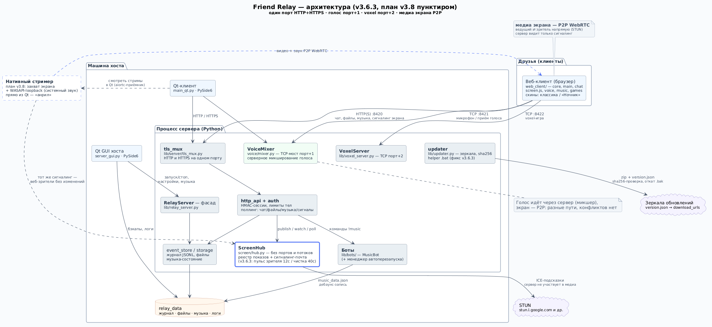

# ROADMAP — план развития Friend Relay (v3.6.3 → v3.8)

> Обновлено: 2026-09-27 · База: **v3.6.3** · Горизонт: **v3.7 «Стабилизация» → v3.8 «Нативный стример»**.
> Формат каждой задачи: **что сделать → зачем → «Готово, если: …»** (критерий не даёт задачу считаться закрытой «по ощущениям»).
> Приоритеты: **P0** — делать первым, **P1** — существенно, **P2** — когда захочется.
> Схема архитектуры: `docs/plans/architecture.puml` (+ отрендеренный `architecture.png` рядом).
> Прежний ROADMAP (времён v3.4.2) переписан: его P0 полностью закрыт в v3.5.0 (см. архив в конце), открытые P1/P2 перенесены в бэклог §4 — ничего не потеряно.

---

## 1. Где мы сейчас (v3.6.3)

Проект уже умеет много: чат с файлами и ЛС, музыкальный бот с синхронизацией, голос (серверный микшер на порт+1), демонстрация экрана P2P через WebRTC с адаптивным качеством и авто-реконнектом зрителя, игры (шахматы, го, орбитал, voxel на порт+2), самообновление с зеркалами и откатом. Инфраструктура качества: ~45 тест-скриптов (свыше 1500 проверок), стресс-прогон 300 запросов с p50=0.7 мс, дебаг-проход v3.6.2→v3.6.3 закрыл пять реальных багов (апдейтер, счётчик зрителей, гонка у зрителя).

Чего честно нет. Во-первых, **истории изменений**: проект живёт zip-ами — откатить «вчерашнюю правку» негде, diff между версиями делается вручную. Во-вторых, **проверок на живых людях**: E2E-тесты гоняют двух участников, а реальные баги живут на третьем (гонки счётчиков, микшер голоса, рассинхрон музыки при 4+ клиентах). В-третьих, **цифр по голосу**: «лагает» измерить нечем — в панели «Голос» нет пинга и потерь. В-четвёртых, **системного звука экрана вне Chromium**: Firefox/Safari показывают картинку без звука (ограничение браузеров), а костыль «Стерео микшер» из v3.6.2 требует ручной настройки — именно это закрывает нативный стример в v3.8.

## 2. v3.7 — Стабилизация (ближний релиз)

### R1. Git локально — P0

**Что.** Инициализировать репозиторий прямо в папке проекта, сделать первый коммит и тег. Готовый набор команд (Windows, из папки `friend_relay_v3.6.3`):

```bat
git init
git add .
git commit -m "v3.6.3: фиксы дебаг-прохода (updater, счётчик зрителей, гонка viewPc)"
git tag v3.6.3
```

`.gitignore` положить ДО первого коммита:

```
__pycache__/
*.pyc
relay_data/
logs/
backups/
dist/
build/
.pytest_cache/
.ruff_cache/
```

**Зачем.** Единственная «история» сейчас — zip-ы с датами; любое рискованное изменение (а в v3.8 их будет много) должно откатываться одной командой, а diff релизов — делаться `git diff v3.6.3..HEAD`. Сборка релиза уже безопасна: repack-скрипт исключает `.git` из архива (SKIP_DIRS), так что папка репозитория в zip не попадёт.

**Готово, если:** `git log` показывает коммит с тегом `v3.6.3`; после запуска сервера `git status` остаётся чистым (relay_data и логи игнорируются); `repack` собирает архив без `.git`.

### R2. Дебаг-стенд «хост + 2 друга» — P0

**Что.** Сценарий на одной машине: сервер + хост-GUI + два окна браузера (один со скином «Ночник») + Qt-клиент. Прогнать фиксированный чеклист: голос втроём; экран ведущего на двух зрителей одновременно и со сменой ведущего на ходу; музыка + голос вместе; передача файла во время стрима; партия в шахматы на фоне показа. Все находки — новым разделом в этом файле («Найдено на стенде»).

**Зачем.** Всё автоматизированное E2E сейчас двухучастниковое (`scripts/debug_e2e_v362.py`); третье подключение ломает предположения кода — именно на стыке трёх клиентов живут гонки, которые не видно в одиночных тестах.

**Готово, если:** чеклист пройден полностью; каждый найденный баг либо починен, либо записан в бэклог §4 с пометкой версии.

### R3. Стресс и долгие сессии — P1

**Что.** Расширить `scripts/stress_v362.py`: 5–10 «фантомных» клиентов с поллингом + одновременный сигналинг экрана + TCP-подключения к голосовому микшеру, прогон 30 минут с замером RSS и латентности. Заодно — обёртка `scripts/run_tests.bat` под Windows (тот же цикл, что в regression-скрипте, но без bash), чтобы вся регрессия запускалась одним файлом на «живой» машине.

**Зачем.** Текущий стресс — это 50 параллельных на один запрос (пик), а утечки и деградация видны только на дистанции. Обёртка нужна потому, что тесты — самодельные скрипты (не pytest), и без неё регрессия на Windows запускается руками по одному файлу.

**Готово, если:** 30-минутный прогон держит RSS в пределах ±10% от стартового, p95 латентности поллинга < 50 мс, в логе 0 ошибок; `run_tests.bat` на чистой Windows прогоняет все не-Qt тесты и печатает сводку.

### R4. Телеметрия связи в панели «Голос» — P1 — ✅ ГОТОВО (v3.5.7 Qt + v3.6.6 веб)

**Как сделано.** Клиент шлёт ping каждые 2с, микшер отвечает pong со
счётчиками кадров (in/out/odd — сколько принял от нас / отправил нам /
отверг по размеру); клиент считает RTT и ЧЕСТНЫЕ потери ↑↓ из дельт
счётчиков и рисует строку вида «📶 23 мс · потери ↑0% ↓1%» с цветным
вердиктом (пороги good ≤80мс/≤2%, bad >200мс/>8% — voice/config.py).
В Qt это работает с v3.5.7; в v3.6.6 то же появилось в ВЕБ-клиенте:
мост проксирует {t:ping} браузера микшеру (раньше считал его алиасом
heartbeat'а — до микшера кадр не доходил), pong возвращается текстом,
voice.js считает те же метрики и красит строку статуса.

**Попутно закрыт последний блокирующий sendall голосового стека**
(v3.6.6): отправка микшера выведена из потока такта в per-client
потоки-отправители — замиравший через ZT клиент больше НЕ даёт тишину
у всех участников (раньше один sendall в такте вставал на сотни мс и
останавливал микс для всего канала).

**Осталось из исходной постановки:** зеркалирование цифр в
/server/stats (сейчас метрики считаются на клиентах, сервер их не
агрегирует) — см. бэклог §4.

### R5. Мелкие закрытия из старого плана — P2

**Что.** Два маленьких пункта, которые тянут одну сессию: ротация журналов (`history.jsonl` и `logs/server.log` растут бесконечно → ежедневные файлы `<имя>-ГГГГ-ММ-ДД` + gzip старых) и `/healthz` без авторизации (`{version, uptime, боты, память}` — для мониторинга и диагностики).

**Зачем.** Ротация спасает диск хоста, который живёт месяцами; `/healthz` — стандартная точка «жив ли хост» для любого будущего мониторинга.

**Готово, если:** за неделю работы в `logs/` появляются датированные файлы, текущий — без даты; `curl http://хост:порт/healthz` отвечает 200 без ключа и не палит лишнего.

### R6. Релиз v3.7 — чеклист

Обновить `version.json` и README-блок, прогнать полную регрессию (`run_tests.bat`), собрать архив repack-скриптом (он сам проверит .bat/CRLF и наличие фиксов), удалить старый zip. **Готово, если:** архив собран, тесты зелёные, в `version.json` — «3.7.0».

## 3. v3.8 — Нативный стример «анрил»

Главная фича горизонта. **Проблема:** системный звук экрана сегодня отдаёт только Chromium на Windows; Firefox/Safari — картинка без звука (ограничение браузеров, из JS не обходится), а костыль v3.6.2 («Стерео микшер»/VB-Cable как микрофон) требует ручной настройки у каждого ведущего. **Решение:** стримить прямо из Qt-клиента — захват экрана + WASAPI-loopback системного звука + aiortc как WebRTC-движок. Веб-зрители ничего не замечают: сигналинг остаётся прежним.

Порядок работ: S1 → S3 и S2 → S3 (две независимые ветки) → S4 → S5 и S7 → S6. Сервер при этом не меняется вообще (кроме, может, мелочей) — весь код живёт в клиенте.

### S1. Захват экрана из Qt — P0

**Что.** Модуль `screen/native/capture.py`: основной путь — **dxcam** (DXGI Desktop Duplication: 60+ FPS, копия экрана силами GPU, Windows 8.1+), fallback — **mss** (медленнее, но кроссплатформенно). Кадры — numpy-массивы в очередь потребителю. Отдельно решить частые грабли: смена разрешения/мониторов на ходу, захват конкретного окна (v2 — отложить), DPI-масштабирование.

**Зачем.** Фундамент всего стримера; от выбора библиотеки зависят FPS, CPU и стабильность — ошибки здесь не отладить потом поверх aiortc.

**Готово, если:** тестовый скрипт 30 с пишет превью-кадры с метками времени; на 30 fps 1080p CPU < 15%; смена разрешения не роняет захват (кадры просто возобновляются).

### S2. Системный звук через WASAPI-loopback — P0

**Что.** Модуль `screen/native/audio.py`: **PyAudioWPatch** (WASAPI loopback, MIT) — запись всего вывода выбранного аудиоустройства в 48 kHz float32; выбор устройства в настройках Qt; захват — в отдельном потоке/процессе, чтобы никогда не блокировать GUI-поток (урок v3.4.1). sounddevice из текущих зависимостей loopback не умеет — потому отдельный пакет.

**Зачем.** Это и есть «анрил»: системный звук стрима без «Стерео микшера», наушники ведущего не мешают — loopback снимается с устройства вывода до наушников.

**Готово, если:** 10-минутный захват без щелчков и дрейфа (метки времени кадров идут ровно), CPU < 3%; переключение аудиоустройства в Windows переживается без перезапуска стрима (или с честным «звук оборвался — перезапусти»).

### S3. Кодирование и отправка (aiortc) — P0

**Что.** Новая зависимость **aiortc** (в `requirements.txt` с верхней границей, как у всех пакетов после урока v3.5.0; она потянет PyAV — учесть вес). Видео: кадры S1 → `av.VideoFrame` → `VideoStreamTrack`; аудио: S2 → `AudioStreamTrack` (Opus). Кодеки: VP8 + Opus как в веб-версии (H264/hw-энкодеры — отдельный эксперимент после паритета). Петля asyncio — в отдельном потоке со своей очередью кадров; GUI-поток только кладёт кадры и читает статистику.

**Зачем.** aiortc берёт на себя всё WebRTC: DTLS, SRTP, ICE, кодирование — повторять это руками безумно.

**Готово, если:** python-скрипт стримит тестовые кадры+звук обычному веб-зрителю (`screen.js`) на другой машине — картинка и звук есть; задержка в LAN < 1 с; 30 минут без роста памяти.

### S4. Сигналинг через существующий ScreenHub — P0

**Что.** Нативный ведущий ведёт себя как обычный клиент: подписанная HTTP-сессия (переиспользовать `lib/client.py`), `POST /screen/publish` раз в 8 с, `POST /screen/signal` для offer/answer/ICE, чтение почты через `GET /screen/poll`, честный watch-протокол зрителей. Кнопка в Qt рядом с веб-версией: «Показать (нативно)».

**Зачем.** Весь смысл: **веб-зрители и сервер не меняются вообще** — screen.js уже умеет отвечать на offer, счётчик зрителей (пульс v3.6.3) уже работает. Ноль правок на принимающей стороне = ноль новых багов у друзей.

**Готово, если:** нативный ведущий виден в «Сейчас показывают» у веб-клиентов обоих скинов; веб-зритель подключается и смотрит со звуком; счётчик зрителей честный при закрытии вкладки без «bye».

### S5. Просмотр стрима в Qt-клиенте — P1

**Что.** Обратный путь: Qt-клиент как зритель — hello → приём offer → aiortc-приёмник → отрисовка `VideoFrame` (QVideoWidget/перерисовка в QLabel) + звук через sounddevice; авто-реконнект по образцу screen.js (2 попытки, антидребезг).

**Зачем.** Смотреть стрим без браузера — например, на машине без GUI-браузера или в скине «всё в одном окне».

**Готово, если:** Qt-клиент смотрит и веб-ведущего, и нативного — оба варианта по 10 минут без утечек; обрыв ведущего даёт «переподключаюсь…» вместо чёрного экрана.

### S6. Упаковка и обновлятор — P1

**Что.** Обновить `build_exe.bat`: +aiortc, +PyAudioWPatch, +av (проверить hidden imports у PyInstaller для aiortc/av/pyaudio — классические «собралось, но не стартует»). Прогнать полный цикл updater'а на собранном exe (фикс v3.6.3 — `PID eq`/`chcp`/откат .bak — именно тут и выстрелит по-настоящему). Озвучить в README рост веса exe (aiortc+av добавят десятки МБ).

**Зачем.** Если exe друзей не обновится молча и сам — вся фича не доедет до пользователей.

**Готово, если:** exe собирается и стартует на чистой Windows; обновление с «старого» exe на новый проходит без ручных действий, включая откат при принудительно убитом новом процессе.

### S7. Настройки качества у нативного стримера — P2

**Что.** Паритет с веб-версией v3.6.2: те же профили («движение»/«чтение»/«максимум»), тот же адаптив по getStats (потери >4% или RTT >350 мс — шаг вниз по лестнице битрейта/масштаба, 20 с чисто — шаг вверх).

**Зачем.** Нативный ведущий должен вести себя на слабой сети так же предсказуемо, как веб-ведущий.

**Готово, если:** при искусственных потерях 10% стример сам снижает битрейт и возвращает после восстановления; звук при этом не глушится (как в веб-версии).

## 4. Бэклог идей (внеплановое)

Сюда перенесены все открытые пункты прежнего ROADMAP плюс локальные хотелки — чтобы план v3.7/v3.8 оставался коротким, а идеи не терялись.

**Удобство.** Трей-иконка (свернуть, счётчик непрочитанных в тултипе) и ОС-уведомления о ЛС/упоминаниях при неактивном окне; поиск по истории сообщений (журнал уже в `event_store.py` — LIKE-поиск с фильтром по каналу/автору); бэкап `relay_data` одной кнопкой с авто-ротацией; экспорт чата в .txt/.html.

**Музыка.** Индикатор рассинхрона с кнопкой «подтянуть» (клиент уже знает свою позицию и server_time); radio-режим «включи что-нибудь» для пустой очереди; сохраняемые плейлисты в `music_data.json`; нормализация громкости (ReplayGain/EBU R128, когда есть mutagen); 10-секундное превью трека для хоста.

**Безопасность.** Подпись `version.json` ключом Ed25519 (cryptography уже в зависимостях) — updater проверяет перед распаковкой; тумблер «только HTTPS» у хоста (tls_mux уже умеет оба протокола на одном порту); device-токены вместо одного пароля + панель «сеансы»; ротация админ-ключа без перезапуска.

**Веб/мобилки.** PWA-манифест и иконки («добавить на экран» у друга — и чат как приложение); адаптивный CSS для экранов < 480 px; кнопка QR-кода с прямой ссылкой на файл.

**Дев-гигиена.** CI (локально — `run_tests.bat`, дальше GitHub Actions: ruff + не-Qt тесты + сборка exe по тегу); `mypy --ignore-missing-imports` по `lib/`; бенчи `bench_channel_switch`/`bench_events_since` в лог каждого релиза.

**Локальные хотелки (из обсуждений).** Доработка VPN-фиксера (cp866-вывод, сортировка IP, кнопки «Починить», InterfaceMetric); голосовые артефакты и приоритет голоса над музыкаботом (после R4 — цифры покажут, где болит); красивые кнопки вебчата; большой рефакторинг скинов; приём файлов в Qt-клиенте.

## 5. IDE и инструменты

**Рекомендация: VS Code** — как основной редактор для этого проекта. Причины конкретно под Friend Relay: в проекте вперемешку Python (сервер, GUI) и JavaScript (`web_client/`), а VS Code одинаково хорош в обоих; он бесплатный и лёгкий; дебаггер Python и Git-интеграция из коробки. PyCharm Community силён в Python-рефакторинге, но JavaScript в Community-версии не поддерживается (это Pro-фича) — половина проекта осталась бы «текстом». Cursor — форк VS Code с AI-ассистентом за подписку: если нравится AI-правками, extensions те же, но это вопрос вкуса, а не необходимости.

Расширения VS Code (ID для поиска в marketplace):

| ID | Зачем |
|----|-------|
| `ms-python.python` + Pylance | Python: запуск, дебаггер, подсказки |
| `charliemarsh.ruff` | линтер — кодовая база уже чистится ruff'ом |
| `jebbs.plantuml` | превью `.puml` по Alt+D (java в системе уже есть) |
| `eamodio.gitlens` | кто/когда менял строку — после R1 сильно пригодится |
| `esbenp.prettier-vscode` | форматирование JS — включать вручную (Shift+Alt+F), НЕ formatOnSave, чтобы не перемешивать формат всего web_client в одном коммите |

Мини-настройка `.vscode/settings.json`:

```json
{
  "python.defaultInterpreterPath": "${workspaceFolder}/.venv/Scripts/python.exe",
  "python.terminal.activateEnvironment": true,
  "plantuml.previewAutoUpdate": true,
  "editor.formatOnSave": false
}
```

И `.vscode/tasks.json` — запуск регрессии одной кнопкой (после R3: `scripts/run_tests.bat`):

```json
{
  "version": "2.0.0",
  "tasks": [
    { "label": "Регрессия: все тесты",
      "type": "shell",
      "command": "scripts/run_tests.bat",
      "group": "test",
      "problemMatcher": [] }
  ]
}
```

Превью архитектурной диаграммы: открыть `docs/plans/architecture.puml` → Alt+D (расширение PlantUML); либо без расширения — `python scripts/render_puml.py docs/plans/architecture.puml` (скрипт рендерит через kroki.io и кладёт PNG рядом).

Отладка — коротко (тема отдельной задачи): точки входа для дебаггера — `server_main.py` (сервер) и `main_qt.py`/`server_gui.py` (Qt, ставить `"justMyCode": false`, чтобы видеть стеки aiortc); для v3.8 понадобится `debugpy` с attach к отдельной asyncio-петле стримера — распишем в плане v3.8 отдельным шагом.

## 6. Диаграмма архитектуры



Как читать. Серая рамка «Процесс сервера (Python)» — то, что живёт в одном процессе `server_main.py`; **один порт** обслуживает и HTTP, и HTTPS (`tls_mux`), голос — отдельный TCP-порт+1 с серверным микшированием, voxel-игра — порт+2. Синяя рамка у **ScreenHub** — главный путь v3.8: сигналинг экрана, через который нативный стример подключится без изменений сервера. Пунктирные блоки («Нативный стример») — план, их ещё нет. Оранжевый цилиндр — всё, что лежит на диске хоста; облака — внешние сервисы (STUN — подсказки ICE для P2P, зеркала — откуда качается обновление). Ключевое свойство — медиа экрана идёт **напрямую между ведущим и зрителем** (P2P WebRTC): сервер пересылает только служебные сигналы, поэтому стрим не грузит хост-машину.

## 7. Архив: что уже сделано из прежнего ROADMAP

Прежний файл (план «после v3.4.2») закрыт целиком по P0 в **v3.5.0**: faulthandler с дампами стеков в `logs/crash.log`, watchdog GUI-потока (`lib/stability.HangWatchdog`), глобальные excepthook'и, автоперезапуск ботов с бэкоффом, авто-переподключение клиента, пины зависимостей с верхней границей, устранены 4 вечных FAIL музыкальных тестов. Его открытые P1/P2 (трей, поиск, бэкап, музыкальные фичи, безопасность, PWA, CI) перенесены в бэклог §4 без изменений смысла. Этот файл заменяет прежний полностью.
